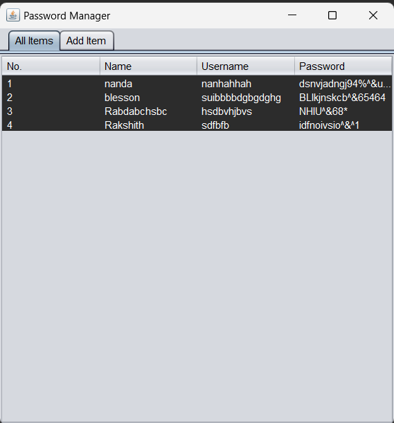
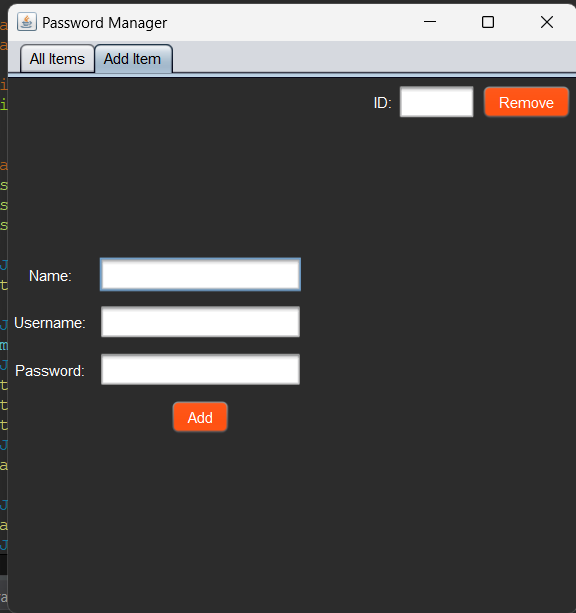

# Notes_Password-_Manger
# Password Manager & NotePad Project

This project is a simple Java application that includes a Password Manager and a NotePad.

## Contributors

- **Rakshith**: 2200080099
- **Blesson**: 2200080192
- **Nanda**: 2200080078

## Files

The project contains the following files:

1. **PasswordManager.java**: Contains the implementation of the Password Manager application.
2. **NotePad.java**: Contains the implementation of the NotePad application.

## Usage

To use the project:

1. Clone the repository to your local machine.
2. Open the project in Eclipse IDE.
3. Navigate to the `src` directory.
4. Run `PasswordManager.java` to use the Password Manager.
5. Run `NotePad.java` to use the NotePad.

## Password Manager

The Password Manager allows users to securely store their passwords. It provides the following functionality:

- Add a password: Allows users to add a new password entry.
- View a password: Allows users to view a previously added password.

## NotePad

The NotePad application allows users to create, view, and edit text files. It provides the following functionality:

- Create a new note: Allows users to create a new text file.

- View existing note: Allows users to view the contents of an existing text file.

## Images

This directory contains images related to the project. 
- 
- 
- 
- 

